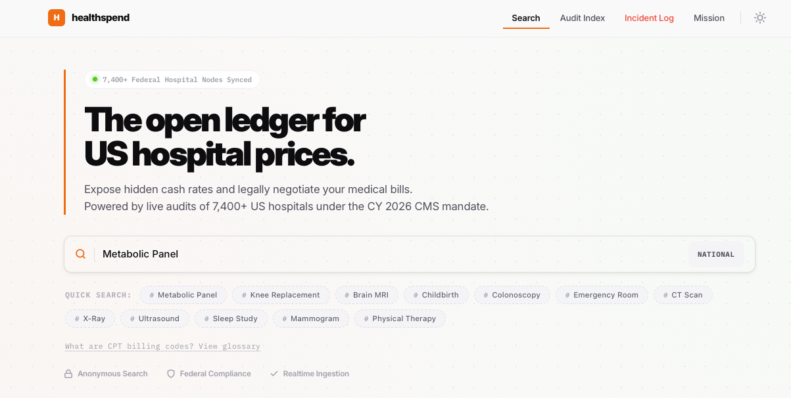

<p align="center">
  
</p>

<h1 align="center">Healthspend</h1>

<p align="center">
  <strong>Open-source hospital price transparency tooling.</strong><br />
  Search published hospital cash prices, inspect compliance signals, and work with machine-readable transparency data.
</p>

<p align="center">
  
</p>

## What this project does

Healthspend helps people and teams work with U.S. hospital transparency data.

- Parses machine-readable hospital price files (MRFs)
- Stores normalized pricing and compliance data in SQLite
- Serves a fast web UI for search and comparison
- Exposes audit-oriented views for transparency analysis

## Repository layout

```text
healthspend/
├── scraper/                  # Rust data pipeline: discovery, audit, parsing
│   ├── src/
│   └── Cargo.toml
├── scripts/                  # Utility scripts (validation, metrics, helpers)
├── web/                      # Web app (TypeScript + Vite)
│   ├── public/               # Static assets and generated SQLite artifacts
│   ├── src/                  # UI, search, data access, views
│   └── package.json
├── ingest.py                 # CMS hospital/compliance ingestion into SQLite
└── README.md
```

## Tech stack

- Rust (`scraper`) for high-throughput parsing and auditing
- SQLite as the analytics/search data store
- TypeScript + Vite (`web`) for the frontend
- Python scripts for ingestion and operational utilities

## Quick start

### Prerequisites

- Node.js 18+
- Rust (stable toolchain)
- Python 3.11+
- SQLite CLI (recommended for local inspection)

### 1 Run the web app

```bash
cd web
npm install
npm run dev
```

### 2 Build scraper locally

```bash
cd scraper
cargo check
cargo run --release -- --help
```

### 3 Ingest CMS hospital metadata locally

From the repository root:

```bash
python3 ingest.py
```

This writes/updates local SQLite data under `web/public/` using nondestructive UPSERT behavior.

## Data notes

- Data originates from publicly available CMS resources and hospital-published MRFs.
- Coverage can vary by hospital, state, file quality, and publication format.
- Some procedures may be missing in specific snapshots; this is a data availability issue, not always a query issue.

## Contributing

Contributions are welcome.

- Follow [CONTRIBUTING.md](CONTRIBUTING.md)
- Keep changes scoped and include validation steps when possible

## Legal disclaimer

Healthspend is provided for transparency, research, and educational use. It is not legal, medical, or billing advice.

## License

[MIT](LICENSE)
