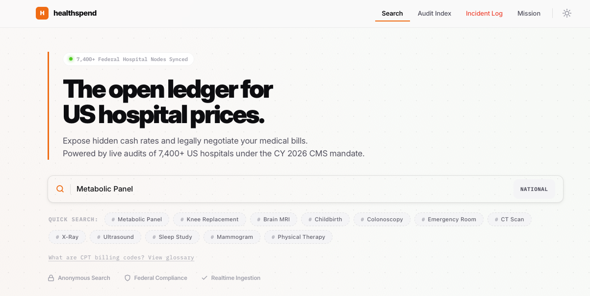

<p align="center">
  
</p>

<h1 align="center">Healthspend</h1>

<p align="center">
  <strong>Compare hospital prices. Challenge bills above posted cash rates.</strong><br />
  A free, patient-first transparency app — search published cash rates, review compliance signals, and draft billing emails from federal hospital data.
</p>

<p align="center">
  <a href="https://healthspend.lol">healthspend.lol</a>
</p>

<p align="center">
  
</p>

## What it is

Healthspend helps people use U.S. hospital **price transparency** data in everyday decisions:

- **Before care** — search a procedure and see published cash rates near you
- **After a bill** — compare what you were charged to the hospital’s posted rate and use an email template to ask questions
- **Transparency gaps** — browse compliance scores and incident-style signals (research use; not legal advice)

The app runs entirely in your browser against SQLite snapshots — no account, no backend search API.

## Repository layout

```text
healthspend/
├── scraper/                  # Rust pipeline: MRF discovery, audit, parsing
├── scripts/                  # Validation, hot-shard build, deploy helpers
├── web/                      # Vite + TypeScript SPA
│   ├── public/               # Static assets, SQLite DBs (fetched separately)
│   └── src/                  # Search, views, client-side SQL
├── ingest.py                 # CMS hospital/compliance ingestion
└── docs/                     # Methodology, pipeline, legal
```

## Tech stack

- **Rust** (`scraper`) — high-throughput MRF parsing and auditing
- **SQLite** — normalized pricing + compliance ledger
- **TypeScript + Vite** — zero-backend SPA with `sql.js-httpvfs`
- **Python** — ingestion and operational scripts

## Quick start

### Prerequisites

- Node.js 18+
- Rust (stable)
- Python 3.11+
- SQLite CLI (optional, for inspection)

### 1) Fetch the data

`audit_data.db` is not in git. Download from Hugging Face:

```bash
mkdir -p web/public
wget -O web/public/audit_data.db https://huggingface.co/datasets/vladimir-io/healthspend-data/resolve/main/audit_data.db
wget -O web/public/audit_hot.db https://huggingface.co/datasets/vladimir-io/healthspend-data/resolve/main/audit_hot.db
```

### 2) Run the web app

```bash
cd web
npm install
npm run dev
```

### 3) Scraper (optional)

```bash
cd scraper
cargo check
cargo run --release -- --help
```

### 4) Ingest CMS metadata

From the repo root:

```bash
python3 ingest.py
```

## Data notes

- Sources: CMS public data and hospital-published machine-readable files (MRFs).
- Coverage varies by hospital, state, and file quality.
- Missing procedures usually reflect data availability, not a search bug.

## For developers

Patient UI lives at `/`. Static data access docs: `/developers.html`. Datasets and pipeline details: [docs/PIPELINE.md](docs/PIPELINE.md).

## Quality gates

- **Frontend CI**: `npm run build`, `npm run search:check`, Playwright perf budgets
- **Data CI**: audit pipelines → Hugging Face snapshots
- **Docs**: [docs/METHODOLOGY.md](docs/METHODOLOGY.md) · [docs/LEGAL.md](docs/LEGAL.md)

### Hot database shard

Production search prefers `audit_hot.db` (top CPT codes), with fallback to `audit_data.db`:

```bash
python3 scripts/build_hot_db.py --source web/public/audit_data.db --out web/public/audit_hot.db
```

## Contributing

See [CONTRIBUTING.md](CONTRIBUTING.md). Before a PR: `cd web && npm run build && npm run search:check`.

## Legal disclaimer

Healthspend is for transparency, research, and education. It is **not** legal, medical, or billing advice and is **not a substitute for your Explanation of Benefits (EOB)**. Verify prices with the hospital. See [docs/LEGAL.md](docs/LEGAL.md) and [Medicare Care Compare](https://www.medicare.gov/care-compare/).

## License

[MIT](LICENSE)
